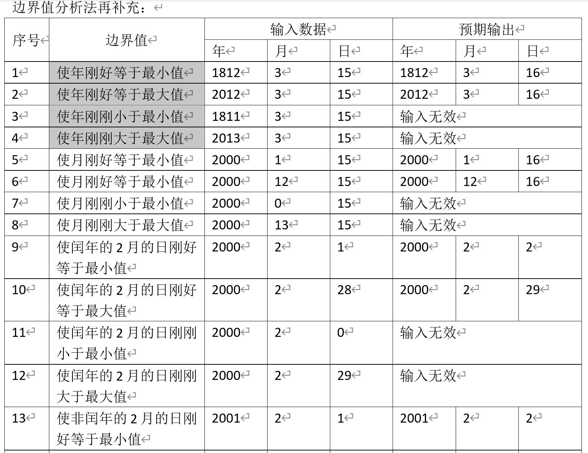
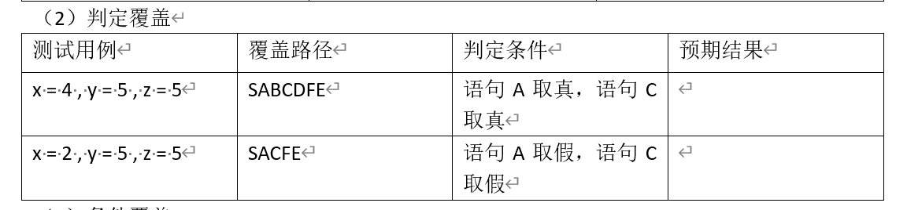
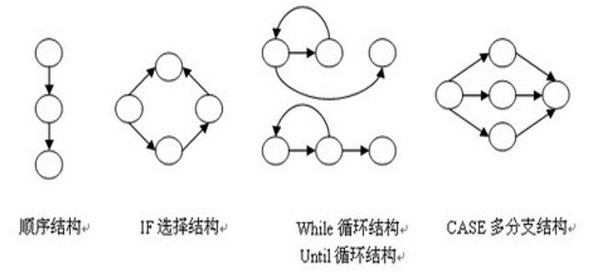

# 第一章

## 软件质量

### 质量概念

> 产品或服务满足客户需求的程度

### 软件质量概念

> 特质软件产品，系统、产品、过程符合客户或用户的要求或者期望的程度；系统、产品、过程符合特定需求的程度。
>
> 从以下三方面考虑
>
> - 软件结构方面：软件应具备良好的结构
> - 功能与性能方面：软件应能按照既定的需求完成工作，并且与明确规定的功能、性能需求一致。
> - 开发标准与文档方面：软件开发应与明确成文的开发标准一致，遵循软件开发准则，做到软件文档资料齐全。
>
> 主要包含六个方面：功能性、可靠性、易用性、效率、可维护性、可移植性
>
> - 功能性：软件实现的功能达到要求的和隐含的用户需求以及设计规范的程度，
>
> - 可靠性：软件在指定条件和特定时间段内维持性能的能力程度，
>
> - 易使用性：用户使用该软件所付出的学习精力，
>
> - 效率：在指定条件下，软件功能与所占用资源之间的比值，
>
> - 可维护性：当发现错误、运行环境改变或客户需求改变时，程序能修改的容易程度，
>
> - 可移植性：将软件从一种环境移入另一种环境的容易程度。

### 评价体系与标准

> 以前软件质量保证由程序员承担，现在由一个组织中 多个机构负责，包括软件工程师、项目管理者、客户、销售人员、和软件质量保证SQA小组的成员。
>
> 软件质量保证是一个有系统的、有计划的行动集合，是为了提供软件产品的软件开发过程与维护过程符合已建立的技术需求，以及跟上计划安排与在预算限制之内进行的管理上的充分信任的必需。
>
> 软件质量保证由各种任务构成。这些任务和两个参与者相关，一个是做技术工作的软件工程师，另一个是负责质量保证的计划、监督、记录、分析及报告工作的软件质量保证小组。

## 软件测试与可靠性概述

### 软件测试的定义

> IEEE：使用人工或自动手段来运行或测定某个系统的过程，检验是否满足规定的需求，或者弄清预期结果与实际结果之间的差别。

### 软件测试的意义

> 1. **确保软件质量**：通过测试发现并修复缺陷，保证软件在投入使用前达到预期的质量标准。
> 2. **提高用户满意度**：高质量的软件能够更好地满足用户需求，提高用户满意度。
> 3. **降低维护成本**：早期发现和修复缺陷，可以减少后期维护和修复的成本。
> 4. **风险管理**：通过测试可以识别和评估软件的潜在风险，避免重大问题的发生。
> 5. **验证和确认**：测试可以验证软件是否按照设计要求实现，确认软件在各种环境下的表现是否符合预期。
> 6. **提高开发效率**：通过及时的反馈和缺陷报告，可以改进开发过程，提升整体开发效率。

### 软件测试的方法

#### 不同角度区分

- 静态测试与动态测试
  - 着眼于是否执行被测软件的角度
- 黑盒测试与白盒测试与灰盒测试
  - 着眼于是否针对系统内部结构和具体实现
- 针对软件开发阶段的软件测试

#### 静态测试

> 无需执行软件，而是使用专门的软件测试工具，评审软件源码和文档。
>
> - 代码检查
> - 静态结构检查
> - 代码质量度量

#### 动态测试

> 构造测试用例，通过人工或自动化工具执行程序，对程序运行结果进行分析。
>
> - 功能确认与接口测试
> - 覆盖率分析
> - 性能分析

#### 黑盒测试

> 数据驱动测试/功能测试
>
> - 等价类划分
> - 边界值分析
> - 因果图
> - 错误推测

#### 针对软件开发阶段的测试

> •需求测试
>
> •单元测试
>
> •集成测试
>
> •性能测试
>
> •压力测试
>
> •容量测试
>
> •配置测试
>
> •回归测试
>
> •安装测试
>
> •安全性测试

#### 白盒测试

> 结果测试/逻辑测试
>
> - 逻辑覆盖
> - 域测试
> - 路径测试
> - 程序插桩
> - 程序变异

## 其他

### 软件质量保证（SQA）

> 一种应用于整个软件过程的保护性活动。
>
> 本质是为了预防，缺陷。

### 软件质量保证和软件质量控制的区别

> 软件质量保证SQA是一种涉及整个软件开发过程的，通过制定标准和流程、审核、培训以及过程改进等活动，确保软件产品符合预期的质量要求的保护性、预防性活动。
>
> 软件质量控制SQC是一种在软件开发过程中，通过检测和审查，发现和纠正软件中的缺陷，以确保软件产品的质量符合要求的活动，通常集中在软件开发过程的测试阶段。
>
> [软件质量控制、质量保证和质量管理区别_软件质量控制 属于 软件质量保证-CSDN博客](https://blog.csdn.net/smile_dyf/article/details/79133537)

#### ChatGPT回答

> ### 软件质量保证（SQA）
>
> **定义**：软件质量保证是指在软件开发过程中，通过制定标准和流程，确保软件产品符合预期的质量要求。SQA 涉及整个软件开发生命周期，包括需求分析、设计、编码、测试和维护等阶段。
>
> **关键点**：
> 1. 预防性活动，确保开发过程中的各个阶段都符合标准。
> 2. 包括制定质量计划、审核、培训和过程改进等。
> 3. 目的是防止缺陷的产生。
>
> ### 软件质量控制（SQC）
>
> **定义**：软件质量控制是指在软件开发过程中，通过检测和审查，发现和纠正软件中的缺陷，以确保软件产品的质量符合要求。SQC 通常集中在软件开发的具体阶段，如测试阶段。
>
> **关键点**：
> 1. 检测和纠正活动，确保产品质量符合标准。
> 2. 包括测试、审查、检查和验证等活动。
> 3. 目的是发现并修复缺陷。
>
> ### 区别
>
> 1. **目标**：
>    - **SQA** 的目标是通过预防性措施确保开发过程的质量，防止缺陷的产生。
>    - **SQC** 的目标是通过检测和纠正措施确保产品的质量，发现并修复缺陷。
>
> 2. **时间点**：
>    - **SQA** 涉及整个开发生命周期，从需求分析到维护阶段。
>    - **SQC** 主要集中在开发的特定阶段，特别是测试阶段。
>
> 3. **方法**：
>    - **SQA** 通过制定和实施标准、流程、培训和过程改进来确保质量。
>    - **SQC** 通过测试、检查和审查等手段来检测和修复缺陷。
>
> 4. **角色**：
>    - **SQA** 主要由质量保证团队或人员负责，关注过程的质量。
>    - **SQC** 主要由测试团队或人员负责，关注产品的质量。

### 软件测试

#### 目的

> 尽可能多地发现软件中隐藏的错误，最终交付高质量的软件系统

#### 定义

> 在软件开发过程中，通过执行软件，验证其功能和性能是否符合预期要求的活动。

#### 意义

> 1. **确保软件质量**：通过测试发现并修复缺陷，保证软件在投入使用前达到预期的质量标准。
> 2. **提高用户满意度**：高质量的软件能够更好地满足用户需求，提高用户满意度。
> 3. **降低维护成本**：早期发现和修复缺陷，可以减少后期维护和修复的成本。
> 4. **风险管理**：通过测试可以识别和评估软件的潜在风险，避免重大问题的发生。
> 5. **验证和确认**：测试可以验证软件是否按照设计要求实现，确认软件在各种环境下的表现是否符合预期。
> 6. **提高开发效率**：通过及时的反馈和缺陷报告，可以改进开发过程，提升整体开发效率。

## 思考题

1. 谈谈自己对软件质量的理解，并谈谈如何看待软件质量的地位？

> 软件质量是满足用户需求的程度。软件质量是软件开发过程的核心地位。没有软件质量，软件产品就是一个失败的产品。

1. 什么是软件工程？什么是软件过程？它们与软件工程方法学有何关系？

> 软件工程是指应用工程化方法和原则来设计、开发、维护和管理软件系统的学科。
>
> **软件过程是指软件开发生命周期中的一系列活动和步骤，包括需求获取、设计、实现、测试、发布和维护。**
>
> 软件工程方法学是指导软件工程实践的一系列原则、方法和工具。它提供了系统化的方法和框架，帮助开发团队有效地进行软件开发。
>
> 软件工程方法学为软件过程提供了指导和规范，使得软件开发过程更加标准化和高效。软件过程是软件工程方法学在实际项目中的具体应用和实践。

1. 用自己的语言描述软件质量保证，并举例说明软件质量与测试对软件企业的正面影响和负面影响。

> 软件质量保证SQA是一种涉及整个软件开发过程的，通过制定标准和流程、审核、培训以及过程改进等活动，确保软件产品符合预期的质量要求的保护性、预防性活动。
>
> 
>
> 好的软件质量与测试给企业带来正面影响：提升客户满意度，降低维护成本，增强市场竞争力等
>
> 坏的...负面影响：延长开发周期，增加开发成本，过度测试与文档化

1. 软件测试和软件开发的关系是怎么样的？常用的软件测试方法有哪些？

> 软件测试和软件开发是软件生命周期中的两个重要阶段。开发负责实现功能，测试负责验证功能。两者相辅相成，共同确保软件产品的高质量。开发和测试之间需要紧密合作，及时沟通和反馈，以便发现和解决问题。

# 第二章

## 软件质量控制的基本方法

### 软件质量控制基本概念

#### 定义

> 软件质量控制是对开发过程中软件产品（包括阶段性产品）的质量信息进行连续的收集、反馈。

### 软件质量控制的基本方法

> 目标问题度量法、风险管理法、PDCA控制法

> 1. 目标问题度量法
>
>    通过确定软件质量目标并且连续监视这些目标是否达到来控制软件度量的一种方法
>
>    具体做法：
>
>    - 对一个项目的各方面规定具体的目标
>    - 对每个目标引出一系列能反应出这个目标是否达到要求的问题，并回答
>    - 将答案映射到软件质量等级的度量上，根据度量得出目标是否达到的结论，或确认哪些做好了哪些还需改善
>    - 收集数据，但要为收集和分析数据做出计划

> 2. 风险管理法
>
>    识别和控制软件开发中，成功地达到目标的过程中危害最大的那些因素的一个系统性的方法。
>
>    实施步骤：
>
>    - 识别风险
>    - 评估发生概率和代价
>    - 根据发生概率和代价划分风险等级并排序
>    - 在项目限定条件下，选择控制风险的技术并指定计划
>    - 执行计划并监视进程
>    - 持续评估风险状态并采取正确的措施3

>  **风险严重程度的等级标准**
>
>  小/低/中/高/危险
>
>  
>
>  **软件项目各阶段可能面临的风险**
>
>  计划阶段：目标/范围/业务不清、缺少沟通、缺乏可行性分析
>
>  设计阶段：缺乏经验、计划仓促、设计漏洞、没有变更控制计划
>
>  实施阶段：缺乏环境、设计错误、开发能力不足、测试不充分、人员变更、沟通不充分
>
>  发布阶段：质量差、客户不满意、设备未按时到货、资金不能及时回收
>
>  
>
>  **风险控制方法**
>
>  - 风险避免
>    - 采用成熟的技术、增加资源、减少软件范围
>
>  - 风险弱化
>    - 简化流程、增加测试、开发原型系统
>
>  - 风险承担
>    - 制定应急方案、随机应变
>
>  - 风险转移
>    - 将风险发生的结果以及对应的权利转移给有承受能力的第三方
>
>  - PDCA质量控制法
>    - 我国常用的是基于PDCA 的TSQC全面服务质量管理模型
>
>
>  
>
>  
>
>  

## 软件质量控制模型

> 我国目前使用基于PDCA的TSQC全面统计质量控制total statistical quality control模型

> TSQC过程是一个调节和控制那些影响软件质量的参数的过程。影响软件质量的参数：
>
> 产品：所有可交付物
>
> 过程：所有活动的集合
>
> 资源：活动的物质基础
>
> ---
>
> 
>
> TSQC过程是PDCA几个活动的循环
>
> 计划plan：确定参数要求
>
> 实施do：根据要求展开活动
>
> 检查check：通过评审、度量、测试确认满足要求
>
> 改进action：纠正参数要求再开发

## 软件质量保证体系

### 能力成熟度模型CMM

capability maturity model

> - SQA（软件质量保证）是CMM（软件能力成熟度）2级中的一个重要关键过程区域，它是贯穿于整个软件过程的第三方独立审查活动，在CMM的过程中充当重要角色。
>
> - 因此，满足SQA是达到CMM2级要求的重要步骤之一。 

### 软件质量保证SQA

#### 定义

> 是建立一套有计划，有系统的方法，来向管理层保证拟定出的标准、步骤、实践和方法能够正确地被所有项目所采用。

#### 目标

> 是向管理者提供对软件过程进行全面监控的手段，包括评审和审计软件产品和活动，验证它们是否符合相应的规程和标准，并给项目管理者提供这些评审和审计的结果。

#### 任务

> 1. 审计与评审软件产品和活动
> 2. 向管理层报告
> 3. 处理审计与评审不通过的问题

## 思考题

1. 简述软件质量控制的基本概念

> 定义：在软件开发过程中对软件产品的质量信息持续收集、反馈。确保软件质量符合预期要求

1. 简述描述几种常见的质量控制模型

> 1. **PDCA循环（Plan-Do-Check-Act Cycle）**：
>    - **计划（Plan）**：确定目标和流程，制定详细的计划。
>    - **执行（Do）**：按照计划实施具体活动。
>    - **检查（Check）**：评估执行结果，对比预期目标，找出差距和问题。
>    - **行动（Act）**：针对发现的问题采取纠正措施，改进流程，进入下一轮循环。
> 2. **六西格玛（Six Sigma）**：
>    - **定义（Define）**：确定项目目标和客户需求。
>    - **测量（Measure）**：收集和测量当前过程性能数据。
>    - **分析（Analyze）**：分析数据，找出影响质量的关键因素。
>    - **改进（Improve）**：制定并实施改进措施。
>    - **控制（Control）**：监控改进后的过程，确保持续稳定。
> 3. **CMMI（Capability Maturity Model Integration）**：
>    - 提供了一个分级框架，帮助组织评估和改进其软件过程，从初始级到优化级共五个成熟度级别。
> 4. **ISO 9001**：
>    - 一个国际标准，提供了一套系统化的质量管理体系（QMS），用于确保产品和服务满足客户和法规要求。

1. 简述软件质量控制的实施过程

- 制定质量标准
- 指定质量计划
- 执行测试和审查
- 收集和分析数据
- 缺陷管理
- 报告和反馈
- 持续改进

1. 简述软件质量保证体系的目标

- 确保软件质量
- 提高客户满意度
- 减少缺陷和返工
- 过程改进
- 风险管理

> 是向管理者提供对软件过程进行全面监控的手段，包括评审和审计软件产品和活动，验证它们是否符合相应的规程和标准，并给项目管理者提供这些评审和审计的结果。

# 第三章

## 软件质量度量的根本目的

> 为了管理的需要利用度量来改进软件过程
>
> （人们无法管理不能度量的事物）

## 度量

> 度量是一种可用于决策的可比较对象

### 度量的目的

> 度量已知的事物是为了进行跟踪、评估。度量未知的事物是为了预测。

## 软件度量

### 定义

> 对**软件开发项目、过程、产品**进行数据定义、收集、分析的持续性定量化过程。
>
> 目的在于，**对此**加以理解、预测、评估、控制、改善

## 软件质量和软件质量要素

### 软件质量

#### 定义

> 系统、产品、过程符合客户或用户的要求或者期望的程度；系统、产品、过程符合特定需求的程度。

### 软件质量要素

> 软件质量是许多质量属性的综合体现，反映了软件质量的方方面面。包括正确性、安全性等。所谓的质量要素主要指以下两个方面：
>
> - 从技术角度讲：对软件整体质量影响最大的那些质量属性才是质量要素
> - 从商业角度讲：客户最关心的，能成为卖点的质量属性才是质量要素
>
> 把精力放在对经济效益贡献最大的质量要素上。
>
> 软件质量保证也就是对重要的质量要素的保证

## 软件过程度量

### 软件过程度量概念

#### 软件过程度量定义

> 对软件过程进行度量的定义、方法、活动和结果的集合。

#### 软件过程度量包含的活动

> - 选择和定义度量、制定度量计划、收集数据、执行度量分析、评估过程性能、根据评估结果采取相应措施等。

#### 软件过程度量的目标

> 对软件过程的行为进行管理，并在度量的基础智商对软件过程进行控制、评价、改善。最终为项目管理9和软件过程管理服务。

#### 软件过程度量的对象

> - 工作产品：软件项目执行过程中产生的交付和不交付的过程产品。如：用户手册和同行评审记录等
>
> - 软件项目
>
> - 过程

#### 方法

>  **经典的度量阶段**
>
> > 从指定度量目标到收集数据再到数据分析
>
> 常用的采集方法和常用的数据分析方法

### 常见问题

- 度量得太多太频繁
- 度量得太少太迟
- 度量了不正确的事物和属性
- 度量的定义不精确
- 收集了数据却没有利用
- 错误地解释度量数据
- 自动化工具欠缺

### 基于目标的软件过程度量方法

GQM（goal-question-metric）基于目标的软件过程度量方法。

> 一种面向目标的、自上而下由目标逐步细化到度量的定义方法，用来告诉组织/机构要采集哪些数据。
>
> 隐含的一个假设是：每一个组织、项目都有一系列目标要实现。
>
> 要实现每一个目标，均要回答一系列问题才能知道目标是否实现了。对提出的每一个问题都可以找到一个完整、可以量化的满意解答。

书本P61

## 软件配置管理

software configuration management -  SCM

### 基本概念

#### 定义？

> 在贯穿整个软件生命周期中建立和维护项目产品的完整性。

### 软件配置管理的目标

> - 软件配置管理的各项工作是有计划进行的
> - 被选择的项目产品得到识别、控制，并且可以被相关人员获取
> - 已识别的项目产品的更改得到控制
> - 使相关组别和个人及时了解软件基准的状态和内容

软件配置管理是软件质量保证活动的重要一环，其主要责任是控制变化。

### SCM的任务（关键活动 ！）

1. 配置项识别
2. 工作空间管理
3. 版本控制
4. 变更控制
5. 状态报告
6. 配置审计

> 总之，软件配置管理的对象是软件研发活动中的全部开发资产

scm的主要任务：

1. 指定项目的配置计划
2. 对配置项进行识别
3. 对配置项进行版本控制
4. 对配置项进行变更控制
5. 定期进行配置审计
6. 向相关人员报告配置状态

## 思考题

1. 简述影响软件质量的因素

> 需求不明确、设计不合理、开发能力不足、没有与客户沟通等等...

1. 简述几种常见的软件质量保证模型

> - CMM能力成熟度模型
> - ISO
> - 六西格玛
> - TQM全面质量管理

1. 简述软件过程度量的目标、对象、方法和结果

结果：

- 改进软件过程
- 生成绩效报告供管理层和项目团队参考
- 为项目管理和决策提供数据支持，优化资源配置和进度管理

1. 简述软件配置管理过程

即主要任务。

> scm的主要任务：
>
> 1. 指定项目的配置计划
> 2. 对配置项进行识别
> 3. 对配置项进行版本控制
> 4. 对配置项进行变更控制
> 5. 定期进行配置审计
> 6. 向相关人员报告配置状态

# 第四章

## 软件可靠性的定义

> 软件可靠性是软件的一个质量要素。
>
> - 在规定的条件下，在规定的时间内，软件不引起系统失效的概率，该概率是系统输入和系统使用的函数，也是软件中存在的错误的函数；系统输入将确定是否会遇到已存在的错误（如果错误存在的话）；
>
> - 在规定的时间周期内，在所述条件下程序执行所要求的功能的能力。

> 定义：**软件在特定环境下和规定时间内无故障运行的能力**

## 软件可靠性模型

> 为预计或估算软件可靠性所建立的可靠性框图和数学模型

### 建立模型的目的？

> 建立可靠性模型可以将复杂系统的可靠性逐级分解为简单系统的可靠性，以便定量预计、分配、估算和评价复杂系统的可靠性。

### 好模型的标准？

> - 适合具体项目开发过程
> - 在实际应用的过程中是可行的有效的
> - 容易执行的

### 好模型有哪些？

> - Musa模型
> - Shooman模型
> - Goel-Okumoto模型
> - 测试成功模型
> - 威布尔模型

### 模型的分类

> 一般按数学结构、模型假设、参数估计等进行分类。

## 提高软件可靠性的方法和技术

1. 建立以可靠性为核心的质量标准
2. 根据项目实际情况选择合适的开发方法
3. 提高软件重用，避免使用不成熟的软件
4. 使用开发管理工具
5. 加强测试
6. 考虑容错设计

## 软件质量标准

> 包括实现的功能、可靠性、可维护性、可移植性、安全性、吞吐率等等

## 思考题

1. 简述软件可靠性和硬件可靠性的区别

> **软件可靠性和硬件可靠性有着本质的区别**，尽管它们都涉及系统在特定时间段内无故障运行的能力。
>
> **软件可靠性**：
>
> - **定义**：指软件在特定环境和时间内无故障运行的能力。
> - **故障原因**：软件故障通常是由设计缺陷、编码错误或需求不明确引起的。
> - **故障表现**：软件的故障是离散的、可重复的。一旦发现并修复，理论上相同的问题不会再出现。
> - **老化现象**：软件不存在物理老化，可靠性在生命周期内是稳定的，但可能受软件环境（如操作系统升级、硬件变化等）影响。
> - **维护方式**：通过修复缺陷、优化代码和更新版本来提高可靠性。
>
> **硬件可靠性**：
>
> - **定义**：指硬件设备在特定环境和时间内无故障运行的能力。
> - **故障原因**：硬件故障通常是由物理磨损、老化或环境因素（如温度、湿度等）引起的。
> - **故障表现**：硬件的故障是连续的、随机的，通常是不可预测的且会随着时间推移而增加。
> - **老化现象**：硬件存在物理老化，可靠性随着使用时间的增加而逐渐降低。
> - **维护方式**：通过定期维护、更换损坏部件和升级硬件来提高可靠性。

1. 简述主要的软件可靠性参数

> 1. **MTBF（Mean Time Between Failures）**：平均故障间隔时间，指软件在两次故障之间的平均运行时间。
>    - 公式：MTBF = 总运行时间 / 故障次数。
> 2. **MTTR（Mean Time To Repair）**：平均修复时间，指从故障发生到恢复正常运行所需的平均时间。
>    - 公式：MTTR = 总修复时间 / 故障次数。
> 3. **故障率（Failure Rate）**：单位时间内发生故障的次数。
>    - 公式：故障率 = 故障次数 / 总运行时间。
> 4. **可靠性函数（Reliability Function, R(t)）**：在时间 t 内，软件无故障运行的概率。
>    - 公式：R(t) = P(T > t)，其中 T 是故障发生时间。
> 5. **可用性（Availability）**：在给定时间段内，软件系统处于正常运行状态的时间比例。
>    - 公式：可用性 = MTBF / (MTBF + MTTR)。

1. 简述流行的五种软件可靠性模型的评价准则

> 1. **预测精度**：模型预测故障发生时间和故障率的准确性。
> 2. **适用性**：模型对不同类型软件系统的适用范围。
> 3. **复杂性**：模型的数学复杂度和计算难度。
> 4. **数据需求**：模型对输入数据的需求，包括数据量和数据质量。
> 5. **鲁棒性**：模型在面对数据不确定性和噪声时的稳定性和可靠性。

1. 简述提高软件可靠性的方法和技术

> 1. 建立以可靠性为核心的质量标准
> 2. 根据项目实际情况选择合适的开发方法
> 3. 提高软件重用，避免使用不成熟的软件
> 4. 使用开发管理工具
> 5. 加强测试
> 6. 考虑容错设计

# 第五章

## 软件质量标准概述

- 国际标准
  - 由国际机构指定和公布供各国参考的标准
  - ISO国际标准化组织international standards organization
  - ISO 9001（质量管理体系）、ISO/IEC 12207（软件生命周期过程）
- 国家标准
  - 由政府或国家级的机构制定或批准，适用于本国范围的标准
  - GB国标
  - ANSI美国国家标准协会American national standards institute
  - GB/T 19001（中国国家质量管理体系标准）
- 行业标准
  - 由一些行业机构、学术团体或国防机构制定，并适用于某个业务领域的标准
  - GJB中华人民共和国国家军用标准
  - IEEE 830（软件需求规格说明标准）、ETSI（欧洲电信标准协会）制定的电信标准。
- 企业规范
  - 一些大型企业或公司，由于软件工程工作的需要，制定适用于本部门的规范
  - 美国IBM公司通用产品部（General Products Division）1984年制定“程序设计开发指南”
  - 某公司内部的编码规范、项目管理流程。
- 项目规范
  - 为一些科研生产项目需要而由组织制定一些具体项目的操作规范，此种规范制定的目标很明确（项目专用）
  - 某软件开发项目的需求文档和测试计划。

## 能力成熟度模型CMM&CMMI

### 如何理解？

> 是的，CMM确实是一种定义和评估“能力”的模型。具体来说，它用于评估和提升组织在软件开发过程中的管理和执行能力。为了进一步说明这一点，让我们再用一个更实际的例子来看看CMM是如何工作的。
>
> ### 例子：软件开发公司的成长
>
> #### 初始级（Initial）：
>    - 一家初创软件公司刚刚成立，开发团队没有固定的流程。项目的成功全靠开发人员的个人能力和努力。常常会有项目延期、质量不稳定等问题。
>
> #### 可重复级（Repeatable）：
>
>    - 这家公司开始意识到需要一些基本的项目管理流程。他们制定了项目计划和基本的时间表，并记录下成功项目的经验。虽然还是有一些问题，但至少能重复之前成功项目的做法。
>
> #### 已定义级（Defined）：
>
>    - 公司制定了详细的开发流程和标准，所有项目都按照这些流程进行。开发团队有了明确的角色和职责分工，新员工可以通过学习这些标准快速上手。
>
> #### 已管理级（Managed）：
>    - 公司开始使用量化的指标来监控项目进展和质量，比如代码覆盖率、缺陷密度等。通过这些数据，他们能够更精确地控制项目的各个方面，发现并解决潜在问题。
>
> #### 优化级（Optimizing）：
>    - 公司建立了持续改进机制，不断收集反馈和数据，进行过程优化。他们采用先进的开发工具和方法，积极进行技术创新，始终保持在行业的前沿。
>
> 通过这个例子可以看出，CMM不仅仅是一个理论模型，它实际指导了组织如何逐步提升自己的能力，从而更高效地完成项目并交付高质量的产品。

### 定义？

> 包括18个过程域、52个目标、300多个关键实践。
>
> 本质是软件工程管理的一部分。
>
> - 它是对于软件组织在定义，实现，度量，控制和改善其软件过程的进程中各个发展阶段的描述。
> - 关系到软件项目成功与否的众多因素中，软件度量、工作量估计、项目规划、进展控制、需求变化、风险管理等，都是与工程管理直接相关的因素。

> CMM模型就是一个帮助软件开发组织提升软件过程能力的模型。通过五个不同的成熟度等级，为软件开发组织提供了一个逐步改进软件过程能力的路径。

### 什么是软件过程？

> software process 是指在软件开发生命周期中，为实现软件产品从需求获取到系统维护的所有步骤和活动。（通常包括：需求分析、系统设计、编码、测试、部署、维护）

### 什么是软件过程能力？

> 是指一个软件开发组织，在软件开发过程中管理和执行其流程的能力。这种能力决定了组织能否高效、稳定地开发出高质量软件产品。反映了组织在计划、实施、监控、改进软件开发活动方面的成熟度和一致性。

### 实施CMM的必要性

> 软件开发风险大是由于软件过程能力低，最关键的问题在于软件开发组织不能很好的管理其软件过程，从而使得一些好的开发方法和技术起不到预期的作用。
>
> 实施CMM是改进软件质量的有效方法，它是控制软件生产过程、提高软件生产者组织性和软件生产者个人能力的有效合理的方法。

### PSP和TSP

#### 定义

> 个体软件过程personal software process、团队软件过程team software process
>
> PSP 是一种旨在帮助软件工程师提高个人工作效率和质量的过程改进方法。
>
> TSP 是在 PSP 的基础上，扩展到团队层面的过程改进方法。

#### 为什么要引入？

> CMM主要关注组织层面的过程改进和管理，对于如何在个人和团队层面具体实施和执行改进措施涉及较少。而PSP和TSP通过具体的方法，补充和强化了CMM，使得软件过程改进措施能够在各个层面得到有效的实施和落实。

### CMMI能力成熟度集成模型

> cmmi是cmm的最新版本。CMMI是在CMM基础上的改进和扩展，提供了一个更全面和灵活的过程改进框架。

## 思考题

1. 简述标准的层次

   答：国际标准、国家标准、行业标准、企业标准、项目规范

2. 简述CMM和CMMI的关系

   > 1. **覆盖范围**：
   >    - **CMM**：专注于软件开发过程。
   >    - **CMMI**：覆盖了多个领域，包括软件工程、系统工程、服务管理和产品开发，适用范围更广。
   > 2. **模型结构**：
   >    - **CMM**：基于单一领域的模型，主要关注软件开发过程。
   >    - **CMMI**：基于多个过程领域的集成模型，提供了一个统一的框架，适用于不同类型的组织和项目。
   > 3. **发展演进**：
   >    - **CMM**：CMM是早期的过程改进模型，提供了一个初步的框架来评估和提升软件过程能力。
   >    - **CMMI**：CMMI在CMM的基础上进行了改进和扩展，整合了多个领域的最佳实践，提供了更全面和灵活的过程改进方法。
   > 4. **成熟度等级**：
   >    - **CMM**：包括初始级、可重复级、已定义级、已管理级和优化级五个成熟度等级。
   >    - **CMMI**：保留了这五个成熟度等级，同时引入了更详细的过程域和实践，使得评估和改进更加具体和可操作。

3. 谈谈软件质量标准之间的关系以及优缺点

# 第六章

## 软件评审的角色和职能

- 评审组长

> 评审会主持人、评审会议的缓和剂
>
> - 决定评审人员名单
> - 安排正式的评审会议
> - 与所有人举行准备会议，确保所有人明确各自责任
> - 确保所有人的关注点是评审内容的缺陷

- 宣读员

> 通过朗读和分段引导评审小组遍历被审材料

- 记录员

> 将评审会上发现的软件问题记录在“技术评审问题记录表”中。

- 作者

> 部门经理或文档撰写人，确保即将评审的文件已经准备好

- 评审员

> 应具备良好的个人能力。
>
> - 熟悉评审内容，为评审最好准备
>
> - 关注问题而不是针对个人
> - 分别讨论主要和次要问题
> - 在会议前或会议后就存在的问题提出建设性意见、建议
> - 明确自己的角色和责任
> - 做好接受错误的准备

## 评审的内容

> P126

- **技术评审**：评估软件的技术实现，包括代码、架构和设计等。
- **过程评审**：检查软件开发过程是否符合既定的标准和流程。
- **文档评审**：审查项目文档的完整性、准确性和一致性。
- **管理评审**：评估项目的管理活动，包括计划、资源分配和进度等。

## 评审的方法

1. **特别检查**
2. **轮查**
3. **走查**
4. **团队评审**
5. **检视**

## 评审的技术

1. 缺陷检查表

2. 规则集

3. 评审工具的使用

   > Gerrit、jupiter、source monitor

4. 从不同角度理解产品

5. 场景分析技术

## 思考题

1. 什么是软件评审？为什么需要进行软件评审？

   > **软件评审**是一个系统的检查和评估软件产品及其开发过程的活动，旨在发现和纠正问题，确保软件的质量和一致性。
   >
   > 为了在缺陷刚引入的时候就发现并及时纠正，提高软件质量、降低软件开发成本、促进团队沟通、确保软件合规性，和风险管理

2. 软件评审包括哪些内容

   > - **技术评审**：评估软件的技术实现，包括代码、架构和设计等。
   > - **过程评审**：检查软件开发过程是否符合既定的标准和流程。
   > - **文档评审**：审查项目文档的完整性、准确性和一致性。
   > - **管理评审**：评估项目的管理活动，包括计划、资源分配和进度等。

3. 软件评审主要有哪些方法？

   > **方法**：
   >
   > - **特别检查**
   > - **轮查**
   > - **走查**
   > - **团队评审**
   > - **检视**

# 第九章

## 软件测试的目的和原则

### 什么是软件测试

> 就是**在软件投入运行前对软件的需求分析、设计、实现编码进行最终审查**。
>
> 就是为了发现缺陷而运行程序的过程。

### 软件测试的目的

> 确保软件的高质量、可靠性和用户满意度，降低风险和维护成本，确保软件在各个方面都能满足预期要求和标准。

### 软件测试的原则

- 在整个开发过程中要尽早地和不断地进行软件测试
- 在开始测试时不应默认程序中不存在错误
- 在设计测试用例时要给测试的预期结果
- 测试工作应避免由系统开发人员或开发机构本身来承担
- 对合理的和不合理的输入数据都要进行测试
- 重点测试错误集群的程序区段
- 除检查程序功能是否完备外还要检查程序功能是否有多余
- 用穷举测试是不可能的
- 长期完整地保留所有的测试用例和测试文件，直至该软件产品被废弃为止

## 软件测试过程

### 软件测试过程概述

#### 软件测试的五个要素

> 软件测试的五个要素：质量、人员、技术、资源和流程

#### 综合测试的步骤

> 在通常情况下，综合测试分为四个步骤：单元测试、集成测试、系统测试、和验收测试，以及贯穿始终的回归测试

#### 测试的种类

> 单元测试、集成测试、功能测试、压力/负载测试、验收测试

###  单元测试

#### 定义

> **对软件中最小可测试单元或基本组成单元**进行检查和验证
>
> 单元的概念已经拓展为**组件component**

#### 单元选取原则

> - 对于面向过程的语言如C语言来说，单元通常指一个函数或子过程。
> - 对于面向对象的语言如Java来说，单元通常指一个类。
> - 在图形化软件中，单元常指一个窗体或一个菜单

#### 测试内容

> •接口测试
>
> •局部数据结构测试
>
> •重要执行路径测试
>
> •错误处理测试
>
> •边界条件测试

#### 测试方法

> 为了模拟模块和它周围模块的关系，需要设计辅助测试模块
>
> - 桩模块（driver）：模拟被测模块的上级调用模块，用于接受测试数据，并向被测模块传输测试数据，启动被测模块，回收并输出测试结果
> - 桩模块（stub）：模拟被测模块在执行过程中所要调用模块，接受被测模块输出的数据并完成它指派的任务

#### 测试技术

> - 静态测试
> - 白盒测试
> - 状态转移测试
> - 功能测试和非功能测试

#### 测试人员

> 一般在开发组长的带领下，由开发设计人员完成。

### 集成测试

#### 定义

> 集成测试是在单元测试的基础上将所有已通过单元测试的模块按照概要设计的要求组装为子系统或系统。

#### 测试内容

> 包括模块之间的接口以及集成后的功能，使用黑盒测试方法测试集成的功能，并对以前的集成进行回归测试

#### 测试方法

[具体介绍](#第十三章)

> - 非增量式的集成测试方法
>   - 定义：将各模块进行独立的单元测试，然后把所有模块组装在一起进行测试，最终得到一个符合要求的软件系统
>   - 容易出现混乱，断定出错位置和原因
> - 自顶向下的增量式集成测试方法
>   - 定义：按照程序结构图，首先利用桩模块测试主模块，通过测试后用实际的模块代替桩模块进行测试，重复上述步骤，直至代替了所有的桩模块。
>   - 基本原则：尽早测试关键模块，尽早测试包含输入输出模块
> - 自底向上的增量式集成测试方法
>   - 定义：按照程序结构图，首先利用驱动模块测试最底层模块，通过测试后用实际的模块代替驱动模块进行测试，重复上述步骤，直至代替了所有驱动模块。

#### 两种测试方法的优缺点

> 

#### 测试技术

> 集成测试主要是测试软件的结构问题，因为测试建立在模块的接口上，所以多为黑盒测试，适当以白盒测试

#### 测试人员

> 从开发组中选出，在开发组组长的监督下进行，负责进行测试。
>
> 测试过程由一个独立测试观察员来监控测试工作。

### 系统测试

#### 定义

> 将已经经过良好的集成测试的软件系统作为整个计算机系统的一部分与其他所有软件外部的运行环境（如硬件、支持软件等）结合在一起，在实际使用的环境下对计算机系统进行一系列的严格测试。

#### 测试内容

P216

> - 功能测试
> - 性能测试
> - 强度测试
> - 可靠性测试
> - 恢复测试
> - 安装测试
> - 安全性测试
> - 配置测试
> - 可用性测试
> - 兼容性测试
> - 网站测试

#### 测试技术

> 完全采用黑盒测试

#### 测试人员

> 由独立的测试小组在测试组长的带领下进行

#### 一些计算

> 平均无故障时间 = 正常运行时间之和 / 总时间
>
> 平均修复时间 = 故障发生到完全修复的时间之和 / 总时间
>
> 平均失效间隔 = 前两者之和

### 验收测试

#### 定义

> 以用户为主，软件开发人员、实施人员和质量保证人员共同参与的有效性测试或合格性测试。

####  测试技术

##### α测试

> 在软件开发公司内模拟软件系统的运行环境下的一种验收测试。
>
> 需要用户参与。
>
> 尽可能逼真地模拟实际运行环境和用户对软件产品的交互，并尽最大努力涵盖所有可能的用户操作方式。

##### β测试

> 软件开发公司组织各方面的典型用户在日常工作中实际使用β版本，并要求用户报告异常情况，提出批评意见，然后软件开发公司再对β版本进行改错和完善。

### 回归测试

#### 定义

> 修改了旧代码后重新进行测试以确认修改没有引进新的错误或导致其他代码产生的错误。

#### 测试人员

> 几乎所有软件开发人员或多或少地参与了回归测试。

### 敏捷测试

#### 测试驱动开发TDD

## 软件测试与软件开发的关系

> 软件测试应从软件开发生命周期第一个阶段开始，贯穿于整个软件开发过程，测试得越早越频繁，开发成本会下降很多。

### 生命周期测试与V模型

- 需求分析

- 设计

- 编码

- 测试

- 安装

- 维护

P29图

# 第十章

### 等价类划分法

#### 题目

> 

#### 答案

> 1. 划分等价类
>
> > title：输入条件（的组合）、有效等价类、编号、无效等价类、编号
> >
> > 
>
> 1. 输出测试用例
>
> > 
>
> 

### 边界值分析法

#### 题目

> 

#### 答案

**先写等价类的内容（即先划分等价类）**

> 1. 划分等价类，同等价类划分法
>
> 

> 老规矩，输出测试用例，这里是分开了有效和无效的测试用例
>
> 

因为上面输出了正常值，因此这里边界值分析法补充：刚等于最大值、刚等于最小值、微微大于最大值、微微小于最小值。针对某一个输入变量而言，其他变量则正常值

> 

### 因果图法

> 决策表的列数看情况写，反正能通过测试的正例要完全，不通过的就随便挑几个写

看书P247和实验2参考答案

# 第十一章

## 控制流测试

**第一步肯定是画程序流程图（注意S和E字母）**

**这里所有测试应该是没有“预期结果”**

### 语句覆盖

#### 定义

> 若干个测试用例，尽可能每个语句至少执行一次。

这里就选择一个测试用例就行了。

> 注意这里title是：测试用例编号 - 输入数据 - 覆盖语句 - 预期结果

### 判定覆盖

#### 定义

> 每个判定的真假至少执行一次

> 注意这里的title是：测试用例编号 - 输入数据 - 覆盖判定 - 预期结果

### 条件覆盖

#### 定义

> 每个判定条件的子条件的真假至少执行一次（每个判定条件由至少一个及以上的子条件，用 || && 连接）

首先给每个判定条件的子条件划分真假

> 每个子条件占用一个数字，真则占用大写T，假则占用小写t
>
> 本题中，前两个子条件是判定条件一，后面两个是判定条件二
>
> title：判定条件 - 子条件 - 取值 - 标记

然后尽可能覆盖每个Tx或者tx

> title：测试用例编号 - 输入数据 - 覆盖条件 - 预期结果

### 条件判定覆盖

#### 定义

> 前两者的综合版本，即每个Tx或tx至少覆盖一次，并且判定条件的真假也要覆盖一次

> title：测试用例编号 - 输入数据 - 覆盖条件 - 覆盖判定 - 预期结果

### 条件组合覆盖

#### 定义

> 每个**判定条件**的**子条件的每种可能的真假**都组合一次。
>
> 如存在一个判定条件if(a > 0 || b  == 1)，假设这个语句的编号是C
>
> 那么有：
>
> 
>
> 

首先画一个类似上面的表格

> title：判定条件 - 赋值 - 类别 - 组合编号

用尽可能少的语句，覆盖这些组合编号

> title：测试用例编号 - 输入数据 - 覆盖组合 - 预期结果

### 路径覆盖

> 每一种可能的路径都要走一次（其实就是所有判定条件的组合，不是判定条件的子条件组合！）

> title：测试用例编号 - 输入数据 - 覆盖判定（A真B假C真之类的） - 覆盖路径 - 预期结果

## 基本路径测试

1. 画出程序流程图

**注意书P278**

> 1. 判定条件如果有多个子条件，要拆分
> 2. 如果题目还要求画程序流程图，那就先画程序流程图。
> 3. 最后画控制流图的时候，根据实际情况合并多步某些流程

1. 计算圈复杂度

-  封闭区域数+1或者区域数
- 边个数 - 结点个数 + 2
- 判定节点数 + 1

1. 导出测试用例
2. 准备测试用例

### 题目

### 答案

> 然后针对每个路径给出测试用例

s

# 第十二章

## 软件缺陷的定义

> 存在于软件（文档、数据或程序）之中的哪些不希望或不可接受的偏差
>
> 结果是软件运行于某一特定条件时出现软件故障，这时称软件缺陷被激活。

## 软件失效的机理

> 软件错误→软件缺陷→软件故障→软件失效

## 软件缺陷的生命周期

> 

## 软件缺陷的严重性（四级）

> - **非常严重的缺陷**：例如，软件的意外退出甚至操作系统崩溃，造成数据丢失。
> - **较严重的缺陷**：例如，软件的某个菜单不起作用或者产生错误的结果。
> - **软件一般缺陷**：例如，本地化软件的某些字符没有翻译或者翻译不准确。
> - **软件界面的细微缺陷**：例如，某个控件没有对齐，某个标点符号丢失等。

## 软件缺陷的有限性（四级）

> - **最高优先级**：例如，软件的主要功能错误或者造成软件崩溃，数据丢失的缺陷。
> - **较高优先级**：例如，影响软件功能和性能的一般缺陷。
> - **一般优先级**：例如，本地化软件的某些字符没有翻译或者翻译不准确的缺陷。
> - **低优先级**：例如，对软件的质量影响非常轻微或出现几率很低的缺陷。

# 第十三章

## 集成测试定义

> 是再单元测试的基础上将多个模块组合在一起进行测试的过程，主要检查各个软件单元之间的相互接口是否正确，是介于单元测试和系统测试之间的过渡阶段，是单元测试的拓展和延申。

## 集成测试策略

书P320

- 非渐增式集成测试
- 渐增式集成测试

> 自顶向下有广度优先和深度优先策略。
>
> 将主控模块作为测试驱动模块，把主控模块进行单元测试时引入的被调用模拟子模块用实际模块进行代替。依据所选的模块集成策略（广、深）将下层的被调用模拟子模块一次一个地替换为真正的模块。在每个模块被集成时都必须立即进行测试。接着回到刚才的步骤重复进行，直到整个系统结构被集成完毕。你你你你你你你你你你你你你你你你你你你                                                                                                                                                                                                                                                                                                                                                                                                                        

- 三明治集成测试
  - 自顶向下和自底向上相结合
- 核心系统先行集成测试
  - 先对核心系统中每个模块进行单独地充分地测试，然后一次性集合到被测系统，接着将外围的模块逐步集成然后进行集成测试
- 高频度集成测试
  - 高频集成测试指同步于软件开发过程每隔一段时间对开发团队的现有代码进行一次集成测试。

## 两种测试方式的比较

- **非渐增式集成测试**断定出错原因和位置比较困难，且在修复错误的过程中容易引入新的错误。
- **渐增式集成测试**对接口的测试比较彻底，容易定位错误原因和位置，但是需要编写更多的测试程序

- **自顶向下的渐增式集成测试**可以自然的做到逐步求精，测试人员一开始就能看到系统的框架，缺点是，需要提供被调用模拟子模块，而其不能完全模拟真实环境。此外，部分模块需要输入输出模块之后才能更容易进行测试。
- **自底向上的渐增式集成测试**有点在于测试方便，如果关键模块在系统结构的底部，那么测试是具有优越性的。缺点是直到最后一个模块被加入进去之后才能看到整个程序的框架。

## 三种测试的区别

> - **单元测试**：针对最小的单元（函数、方法或类），由开发人员进行，确保单个组件的功能正确。
> - **集成测试**：针对多个单元的集成，由开发人员或测试人员进行，确保模块之间的接口和交互正确。
> - **系统测试**：针对整个系统（包括软件系统以及外围软硬件和网络环境），由独立的测试团队进行，确保整个系统满足需求规格并在各种环境下正常运行。

# 第十四章

## 系统测试定义

> - 集成测试通过以后，各模块已经组装成—个完整的软件包，这时就要进行系统测试。
>
> - 系统测试是指将通过集成测试的软件系统，作为计算机系统的一个重要组成部分，与计算机硬件、外设、某些支撑软件的系统等其他系统元素组合在一起所进行的测试，目的在于通过与系统的需求定义作比较，发现软件与系统定义不符合或矛盾的地方

## 系统测试流程

> 书P333

> 1. **性能测试**
> 2. 强度测试
> 3. 安全性测试
> 4. **兼容性测试**
> 5. 恢复测试
> 6. 用户图形界面测试
> 7. 安装测试
> 8. 可靠性测试
> 9. 配置测试
> 10. 可用性测试
> 11. 文档资料测试
> 12. 网站测试

## 性能测试

- 时间性能
  - 一个具体事务的响应时间
- 空间性能
  - 软件运行时消耗的系统资源，它直接决定了系统的最低配置、推荐配置，

## 兼容性测试

- **向前兼容和向后兼容**：确保软件在未来和过去版本中的兼容性。
- **不同版本之间的兼容性**：保证软件不同版本之间的相互兼容和协作。
- **标准和规范**：遵循行业标准和协议，确保系统和组件之间的互操作性。
- **数据共享兼容性**：确保数据在不同系统和软件之间可以无缝共享和交换。

# 第十五章

# 企业面试资料

https://zhuanlan.zhihu.com/p/689790112

# 未准备的

1. 常见常用的软件测试软件